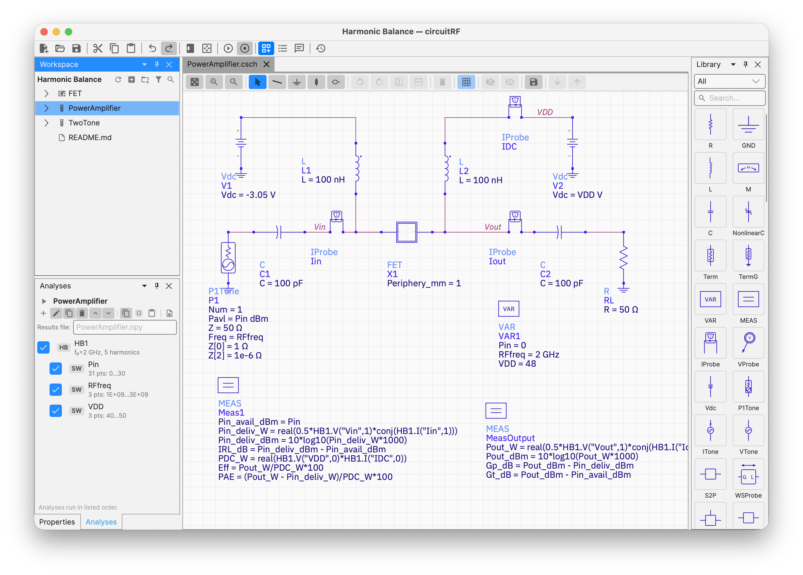
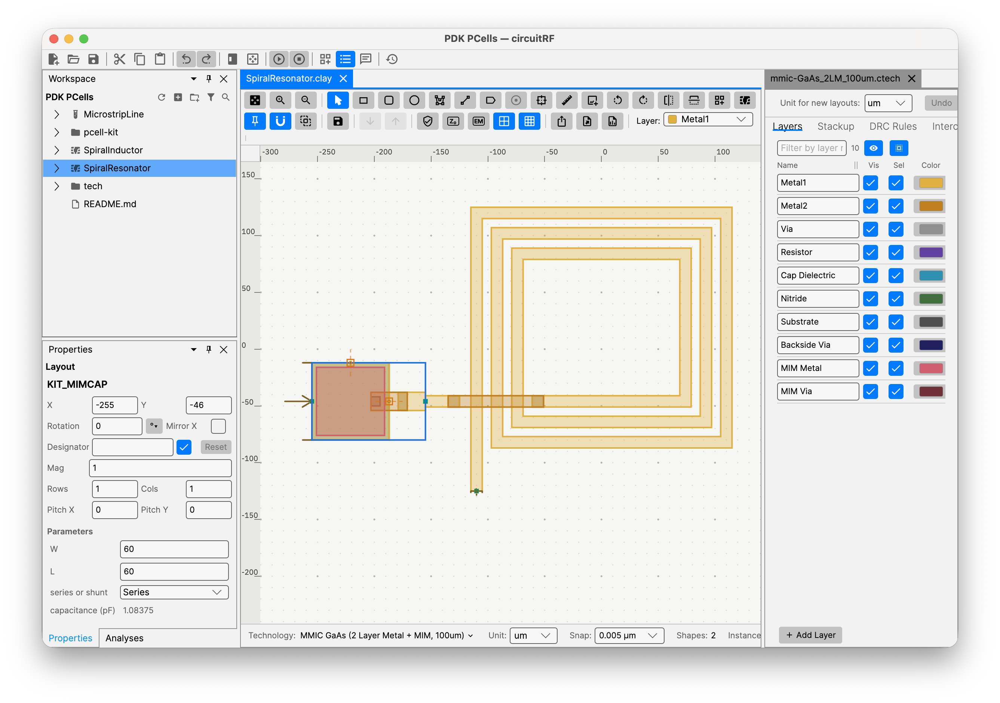
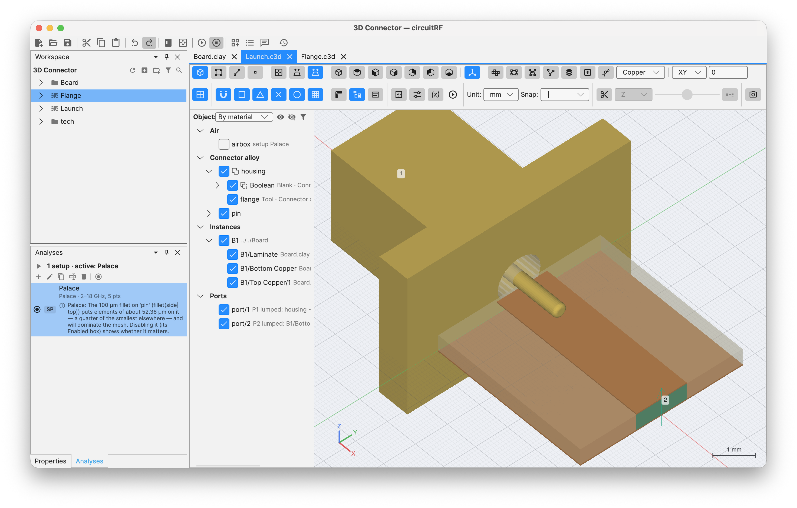

# circuitRF

**A lightweight, cross-platform EDA tool for RF design — for the RF community, by the RF community.**

[](LICENSE)
[](https://dotnet.microsoft.com/)
[](#getting-started)
[](https://avaloniaui.net/)

circuitRF is a full-featured EDA tool for RF and microwave design — schematic capture + nonlinear analysis, layout and
EM and thermal simulation in one cross-platform application. **DC**, **S-parameter** and **harmonic-balance**
analyses with first-class **loadpull / sourcepull**, over designs from a handful of components to
hierarchical, multi-port ones with thousands. A **layout editor** for PCB and MMIC work, with
substrate-aware microstrip components, schematic↔layout generation, **DRC** and **LVS**, and two-way
interchange with **Gerber + Excellon**, **GDSII**, **DXF** and `.kicad_pcb` boards. A **2.5D
electromagnetic solver** over the layout's own substrate stackup. **3D editor** for FEM / FDTD EM solutions (using Palace
/ openEMS), and a built-in FEM **thermal solver**.  Supports command line and MCP.

**📖 [Read the user documentation online](https://potatobeanradio.github.io/circuitRF/)**

circuitRF is for RF practitioners or researchers who can't justify the cost of traditional tools (or find those tools too heavy for a quick investigation): **power-amplifier, LNA, and mixer designers; RF EDA and device-modeling engineers; academic researchers; and capable hobbyists.** It is written in **C# / .NET 10**, with an **Avalonia 12** GUI rendered through **SkiaSharp**, and it was built largely **AI-assisted** (see
[AI-assisted development](#ai-assisted-development)).

> **Status:** 1.0.5. Please file issues.

## Features
- schematic + circuit simulation (DC, S-param, HB, Loadpull)
- 2D layout editor (imports and exports Gerber, GDSII, DXF, .kicad_pcb)
- 3D geometry editor (imports / exports Step)
- hierarchy for all cell view types (including 3D)
- support for PDKs
- bondwire geometry editor and mutual inductance calculator
- 2.5D MoM
- 3D FEM and FDTD (using Palace and openEMS)
- 3D FEM thermal solver
- command line and MCP server ([use it from an AI agent](#use-circuitrf-from-an-ai-agent))
- Documentation with examples

What is *not* in it yet:
> [the open green fields](#what-circuitrf-doesnt-do).

---

## Screenshots

### Schematic editor

<!-- IMAGE TO CREATE: docs/images/schematic-editor.png
     The schematic editor showing a single-FET power amplifier (Hero 2): an SDD FET with gate/drain bias
     (Vdc sources), input and output matching networks (R/L/C), a P1Tone RF source on the left, a Term on
     the output. Left: the Library Palette with component glyph tiles. Right/bottom: the Analyses panel
     with an HB power sweep set up. Show a couple of net labels and the green junction dots so the wiring
     reads clearly. -->
*Build hierarchical RF circuits on a virtualized canvas: drag from the palette, wire, label nets, set
parameters and sweeps, and Run.*

### Data Display — loadpull contours

<!-- IMAGE TO CREATE: docs/images/data-display-loadpull-contour.png
     The Data Display showing a loadpull result on a Smith chart: Pout (dBm) and PAE (%) contours over the
     load-Γ plane, with the MXP (max power) and MXE (max efficiency) markers called out, and a couple of
     interactive markers reading off impedance/value. A trace inspector card on the right shows the
     metric/colormap selection. Optionally a second rectangular plot (power sweep) docked alongside. -->
*Plot S-parameters, spectra, power sweeps, and loadpull contours; overlay measured Touchstone/`.spl`/
`.lpcwave` data on simulated results; plot EM results from MoM, FEM and FDTD solvers (including radiation 
patterns)*

### Layout editor

<!-- IMAGE PLACEHOLDER: docs/images/layout-editor.png — to be supplied by the repo owner. -->
*Draw and edit physical geometry on a technology-defined layer stack: microstrip components generated from
their schematic parameters, hierarchy with arrays, and export to GDSII, DXF and Gerber. MoM EM solver.*

### 3D editor

*Draw and edit in 3D and send to FEM or FDTD EM solvers or the built-in FEM thermal solver*

---

## Download

> **circuitRF 1.0.5 is the current stable release.** Beta versions are published as GitHub
> pre-releases, and *Settings ▸ Security & Permissions ▸ Include beta releases* is what puts them on
> your update channel. It is ticked by default — untick it to receive stable releases only.

| Platform | Download |
|---|---|
| Windows, Intel/AMD | [circuitRF-1.0.5-win-x64-user.msi](https://github.com/potatobeanradio/circuitRF/releases/download/1.0.5/circuitRF-1.0.5-win-x64-user.msi) |
| Windows, ARM | [circuitRF-1.0.5-win-arm64-user.msi](https://github.com/potatobeanradio/circuitRF/releases/download/1.0.5/circuitRF-1.0.5-win-arm64-user.msi) |
| Windows, 32-bit | [circuitRF-1.0.5-win-x86-user.msi](https://github.com/potatobeanradio/circuitRF/releases/download/1.0.5/circuitRF-1.0.5-win-x86-user.msi) |
|  |  |
| macOS, Apple Silicon | [circuitRF-1.0.5-arm64.dmg](https://github.com/potatobeanradio/circuitRF/releases/download/1.0.5/circuitRF-1.0.5-arm64.dmg) |
| macOS, Intel | [circuitRF-1.0.5-x64.dmg](https://github.com/potatobeanradio/circuitRF/releases/download/1.0.5/circuitRF-1.0.5-x64.dmg) |
|  |  |
| Linux, Intel/AMD | [circuitRF-1.0.5-linux-x64.tar.gz](https://github.com/potatobeanradio/circuitRF/releases/download/1.0.5/circuitRF-1.0.5-linux-x64.tar.gz) |
| Linux, ARM | [circuitRF-1.0.5-linux-arm64.tar.gz](https://github.com/potatobeanradio/circuitRF/releases/download/1.0.5/circuitRF-1.0.5-linux-arm64.tar.gz) |


**Linux** — unpack and run `install.sh`. It writes only inside `~/.local`, puts `circuitrf` on your PATH
and registers the menu entry and file types; `--uninstall` removes it and leaves your work alone.

```sh
tar xzf circuitRF-1.0.5-linux-x64.tar.gz
./circuitRF-1.0.5/install.sh
```

**Installing for everyone on the machine?** The Windows `.msi` files without `-user`, and the `.deb`
files, are on the [releases page](https://github.com/potatobeanradio/circuitRF/releases). They need
administrator rights, so they cannot update themselves — they tell you when a new version is out
instead.

Automatic updates can be turned off in **Settings ▸ Security & Permissions**. Building the installers
yourself: [BUILDING.md](BUILDING.md).

---

## Use circuitRF from an AI agent

circuitRF is also an **MCP server**, so an AI agent can create workspaces, write designs, check
them, run simulations and read the results back. The installed application is the server; there is
nothing else to install.

**1. Pick a root folder.** The server can read and write only inside it. Use the folder your
designs live in, such as `~/designs`, not your whole home folder.

**2. Ask circuitRF for its configuration.** It prints the JSON an MCP client needs, with the
executable's full path filled in, and the matching Claude Code command:

| Platform | Command |
|---|---|
| macOS | `/Applications/circuitRF.app/Contents/MacOS/circuitRF serve --root ~/designs --print-config` |
| Windows | `%LOCALAPPDATA%\Programs\circuitRF\circuitRF.exe serve --root %USERPROFILE%\designs --print-config` |
| Linux | `~/.local/bin/circuitrf serve --root ~/designs --print-config` |

**3. Register it with your client.** With Claude Code, run the `claude mcp add …` line it printed.
Most other clients take the printed JSON in their MCP settings. Start a new session afterwards,
because most clients load servers only when a session starts.

**4. Check that it answers.** Ask the agent to call circuitRF's `reference` tool. It should list
the reference topics.

Then read **[Designing with an AI agent](docs/user/reference/ai-agents.html)**, which covers what
to tell the agent, which reference topics it should read first, and the design flow that works. The
full server description, including running it from a source build, is in the
[Command Line chapter](docs/user/reference/cli.html#serve).

---

## Contributors are welcome — *especially RF domain experts*

circuitRF is meant to be **community-driven, by and for the RF engineering community.** We value **RF
domain knowledge as much as software experience.** If you design power amplifiers, LNAs, or mixers; build
RF EDA tooling; do device modeling; or develop transistor technology (GaN-on-SiC, GaN-on-Si, LDMOS, …),
**you are exactly who this project needs** — and circuitRF is a great place to use AI to build the
simulation features *you* want.

You do **not** need to be a professional software developer. If you've scripted in MATLAB or Python, you
have enough to start. Pair yourself with [Claude Code](https://www.anthropic.com/claude-code) (or your
AI assistant of choice) and let it do the heavy lifting on the C#.

---

## Architecture

circuitRF is built in strictly one-directional layers, and nothing below the UI knows the UI
exists. The layers, the engines, the enforced framework firewall and the source tree are described in
**[ARCHITECTURE.md](ARCHITECTURE.md)**.

---

## Getting started

You can help develop circuitRF using **Windows**, **macOS**, or **Linux**.

### 1. Install the tools

| Tool | Why | Get it |
|---|---|---|
| **.NET 10 SDK** | builds and runs circuitRF | <https://dotnet.microsoft.com/download/dotnet/10.0> |
| **Git** | clone the repos | <https://git-scm.com/downloads> |
| **Visual Studio Code** | edit + debug (lightweight, cross-platform) | <https://code.visualstudio.com/> |
| VS Code **C# Dev Kit** extension | C# editing/IntelliSense/debug in VS Code | <https://marketplace.visualstudio.com/items?itemName=ms-dotnettools.csdevkit> |

Verify the SDK is installed:
```bash
dotnet --version      # should print 10.x.x
```

### 2. Clone circuitRF

```bash
# cd to a working folder, then:
git clone https://github.com/potatobeanradio/circuitRF.git
```


### 3. Build and run

```bash
cd circuitRF

dotnet build      # restores packages + compiles everything
dotnet run --project src/Ui # from the circuitRF/ directory:
```

### 4. Optional — testing & building the device workers

```bash
dotnet test       # optional 10-15 min of circuitRF development tests
```

A handful of loadpull tests read lab-measured `.spl`/`.lpcwave` files that are third-party data held
under terms that do not permit redistribution, so they have never been committed here. On a fresh
clone those tests report as **Skipped**, naming the path they wanted — they never fail, and a fresh
clone is green without them. Your own measurements in either format, dropped at those paths, exercise
the same code.

To build the device workers:
Needed only for PDKs whose device models ship as **compiled libraries**. `dotnet build` builds the
workers itself *if a C compiler is on PATH* — with none, it warns and carries on, and such a kit
refuses at Run.

Install one, then rebuild:

```powershell
winget install zig.zig                      # Windows  (or: scoop install zig)
```
```bash
brew install zig                            # macOS
sudo snap install zig --classic --beta      # Linux    (or your package manager)
```
```bash
dotnet build
```

macOS also runs those Linux models in a VM circuitRF ships — one extra ~330 MB download, once:

```bash
dotnet build src/Ui -p:CrfBuildVmImage=true
```

Alternatives to zig (MinGW `gcc`, Docker/Podman) and the rest:
[BUILDING.md ▸ Helper programs](BUILDING.md#helper-programs).


### Note: To package circuitRF as an app with installers

[**BUILDING.md**](BUILDING.md) has step-by-step instructions for producing the installers users
download: `.msi` (Windows x64/arm64/x86, per-machine and per-user), `.zip` (the Windows update
payload), `.dmg` (macOS arm64/x64), `.deb` (Linux x64/arm64) and `.tar.gz` (the Linux user-local
channel). One script per platform, run from the repository root.


---

## Running circuitRF

### To launch the GUI

```bash
# from the circuitRF/ directory:
dotnet run --project src/Ui
```

### To run circuitRF headless from the command line

Full CLI documentation: the
[Command Line chapter](docs/user/reference/cli.html) of the user docs (design notes in
[`docs/design/cli.md`](docs/design/cli.md)).
An installed circuitRF is the command line too (`circuitrf <verb> …`, `circuitrf serve --root <dir>`
for MCP, set up as in [Use circuitRF from an AI agent](#use-circuitrf-from-an-ai-agent)) — for an
agent installing it unattended, see
[Installing for an agent](docs/user/reference/cli.html#agent-install).


```bash
# S-parameters: sweep 1-3 GHz in 50 MHz steps, write a Touchstone file
dotnet run --project src/Cli -- sparam mycircuit.cnl --freq 1GHz:3GHz:50MHz -o mycircuit.s2p

# DC operating point
dotnet run --project src/Cli -- dc mycircuit.cnl

# Harmonic balance (runs the parametric sweep, if one wraps the analysis)
dotnet run --project src/Cli -- hb hero2.cnl --set Pavl_dbm=0 -o hero2.npy

# Loadpull over the directive's Gamma grid, exported as loadpull interchange
dotnet run --project src/Cli -- lp hero3.cnl --pin -20:1:15 -o hero3.spl

# Loadpull pursuit: search for the max-power and max-efficiency terminations
dotnet run --project src/Cli -- lpp hero3B.cnl --out-grid found.gam -o hero3B.npy

# Electromagnetic extraction of the layout a .cem names — no other arguments needed
dotnet run --project src/Cli -- em Amp.cem

# Author a correct initial document: a workspace, then a cell inside it
dotnet run --project src/Cli -- new workspace ~/designs/Amp --tech pcb-4layer_FR-4_62mil_1oz
dotnet run --project src/Cli -- new cell ~/designs/Amp Stage1 --views schematic,symbol

# Bring artwork or a component in: one interchange format to another, or a part as a cell
dotnet run --project src/Cli -- convert Filter.dxf -o gerbers/
dotnet run --project src/Cli -- import part parts/ --into ~/designs/Amp --cell SOT-23

# Is it well formed, does it resolve, is it sound? Runs no analysis and writes nothing
dotnet run --project src/Cli -- check ~/designs/Amp

# Does the artwork match the drawing? (LVS — read-only; -o writes a report)
dotnet run --project src/Cli -- lvs ~/designs/Amp/Stage1

# What did circuitRF DECIDE — which technology, which chain, what value?
dotnet run --project src/Cli -- explain Amp.cem
dotnet run --project src/Cli -- explain Stage1.csch --expr "Zopt*2"

# Read a result back, or a document, as one JSON document
dotnet run --project src/Cli -- read results/Amp_em.npy --only S --json

# Dump the elaborated netlist (flattened + parameters resolved) - great for debugging
dotnet run --project src/Cli -- elab mycircuit.cnl

# Print the MCP client configuration for this build (an MCP client starts the server itself;
# see "Use circuitRF from an AI agent" above, and point clients at a built dll, not at dotnet run)
dotnet run --project src/Cli -- serve --root ~/designs --print-config

# Help
dotnet run --project src/Cli
```

### Run a netlist through an engine (in code)

The whole pipeline is three calls — read → elaborate → run — which is exactly what the CLI does:

```csharp
using CircuitRF.Core.Netlist;
using CircuitRF.Core.Elaboration;
using CircuitRF.Engine;

var (lib, testbench) = CnlReader.ReadFile("mycircuit.cnl");
var netlist          = new Elaborator(lib).Elaborate(testbench);
var dataset          = SParameterEngine.Run(netlist, freqsHz);   // → a DataSet of DataCubes
```

---

## What circuitRF doesn't do yet

- **UI for Tuning and optimization** — no interactive parameter tuner, and no optimizer.
- **Noise analysis** — no noise figure, no phase noise, no Fmin / Γopt / Rn extraction.
- **Transient analysis** — circuitRF is frequency-domain by design; there is no time-domain solver.
- **Envelope analysis** — no simulation of modulated waveforms (no ACPR, no EVM, no pre-distortion)

If you want to contribute to any of the above, please contact me.

---

## User documentation

The user documentation — Quick Start, New User's Guide and Reference Guide — is published at
**<https://potatobeanradio.github.io/circuitRF/>**. It lives in `docs/user/`, is what
**Help ▸ circuitRF Documentation** opens, and is served online straight from this repository,
so the web pages and the shipped pages are the same bytes. **It is generated, not hand-edited.** One
command rebuilds every page and every figure from the live application:

```bash
dotnet run --project tools/DocGen -- --out docs/user
dotnet run --project tools/DocGen -- --page docs/user/src/reference/wbond.md   # just this page, in seconds (prose edits only; no figures)
```

Prose is authored as Markdown under `docs/user/src/`; the pages under `docs/user/` are the output and
any edit to one is reverted by the next run. Figures are **vector captures of the running interface**
— the generator opens circuitRF headlessly, drives real views with real content, and writes SVG — so
they cannot drift from the application. Component parameter tables come from the live registry for
the same reason. There are no screenshots in this documentation and there are not meant to be.

`tools/DocGen/check-docs-current.sh` regenerates and diffs, and fails if the committed output is not
what the generator produces. Run it after a UI change that moves a figure. The design note is
[`docs/design/user-docs-factory.md`](docs/design/user-docs-factory.md).

### Slide decks

The same sources also produce four landscape PDF decks into `docs/slides/` (git-ignored, a build
product). Both options default to everything:

```bash
dotnet run --project tools/DocGen -- --slides docs/slides                                # all 4, light + dark
dotnet run --project tools/DocGen -- --slides docs/slides --deck overview --theme dark
```

- `--deck overview | new-user | quick-start | reference` — why adopt it; first principles; the fast
  path for engineers who already use simulators; the Reference Guide in outline. Comma-separated.
- `--theme light | dark | both` — picks the **screenshots** as well as the page colour.

---

## Contributing

**Contributions are welcome and encouraged.** circuitRF is community-driven, by and for the RF community,
and **RF domain knowledge counts as much as software experience.** You don't need to be a career
programmer — MATLAB/Python scripting experience plus an AI assistant is plenty.

**Good first contributions:**
- Build a circuit in the schematic editor and **report what's confusing or broken**
- Improve a design note in `docs/design/`, or a `CLAUDE.md`, where the docs lag the code.
- Pick up a **roadmap** item (the noise green field is wide open).

**The ground rules:**
- The [architecture](ARCHITECTURE.md) is layered and the **UI firewall is enforced** — keep Avalonia out of
  `RfCore`/`Core`/`Engine`/`Design`/`Cli`/`Harmonica`/`WBond` (a CI test will catch you).
  Renderers stay Skia-only.
- **Every numerical change needs a `testdata/` regression test** within the tolerance the PRD states.
- The core is **MIT** — never ingest GPL code.
- Each subsystem has a `CLAUDE.md` with its local conventions; read the relevant one before diving in.

Open an issue to discuss anything substantial before a large PR, so we can point you at the right design
note (and save you rework).

---

## AI-assisted development

circuitRF was built largely with AI assistance (primarily [Claude](https://www.anthropic.com/claude) /
[Claude Code](https://www.anthropic.com/claude-code)), and **AI-assisted contributions are first-class
here.** The codebase is structured for it: spatial `CLAUDE.md` memory files capture the invariants and
local conventions of each subsystem, `docs/design/` holds the reasoning behind each part, and
`docs/skills/` holds step-by-step procedures you can hand directly to an AI agent.

This is the deliberate bet of the project: **an RF expert with an AI assistant can build the simulation
features they need.** If that describes you, you're in the right place.

---

## License

circuitRF's own source code is released under the **[MIT License](LICENSE)**. A future commercial
superset, if any, layers on through a clean extension boundary without forking the core.

The distribution also contains third-party components under their own terms, inventoried in
**[THIRD-PARTY-NOTICES.md](THIRD-PARTY-NOTICES.md)**. Three of them are copyleft and worth knowing about
before you redistribute a build:

- **[CSparse.NET](https://github.com/wo80/CSparse.NET)** (sparse complex LU, used throughout the engine)
  is **LGPL-2.1-only**. The packaged installers link it statically, so LGPL §6's relink requirement
  applies — satisfied here by publishing complete source, since anyone can substitute a modified
  CSparse.NET and rebuild. If you redistribute circuitRF binaries, that obligation travels with them.
- **[Open CASCADE Technology](https://github.com/Open-Cascade-SAS/OCCT)** (the geometry kernel behind
  booleans, fillets and STEP, run by `tools/geometry-worker`) is **LGPL-2.1-only with the Open CASCADE
  Exception**. The installers carry it unmodified as shared libraries in one replaceable folder, and
  its source is available under the written offer in the notices. The repository holds none of it:
  building from source fetches it with the recipe in `tools/geometry-worker/occt/`.
- **[`tools/osdi-worker/osdi.h`](tools/osdi-worker/osdi.h)** is **MPL-2.0** (© 2022 SemiMod GmbH, from
  ngspice). MPL is copyleft at file scope: the file may live inside an MIT project, but it stays MPL
  and its header notice must not be removed.

No strong-copyleft (GPL/AGPL) code is ingested, and none is planned — see `CLAUDE.md` for the standing
rule on learning from GPL simulators without copying them.

---

## Acknowledgments

- **[Avalonia](https://avaloniaui.net/)** (cross-platform UI — MIT)
- **[SkiaSharp](https://github.com/mono/SkiaSharp)** (2D rendering — MIT)
- **[CSparse.NET](https://github.com/wo80/CSparse.NET)** (sparse complex LU — **LGPL-2.1-only**)
- **[Open CASCADE Technology](https://github.com/Open-Cascade-SAS/OCCT)** (geometry kernel — **LGPL-2.1-only** with the Open CASCADE Exception 1.0); circuitRF uses facilities provided by Open CASCADE Technology
- **[NumFlat](https://github.com/sinshu/numflat)** (dense linear algebra — MIT)
- **[FftFlat](https://github.com/sinshu/FftFlat)** (FFT — MIT)
- **[Clipper2](https://github.com/AngusJohnson/Clipper2)** (integer-coordinate polygon clipping and offsetting, used by the layout editor — Boost Software License)
- **[CommunityToolkit.MVVM](https://github.com/CommunityToolkit/dotnet)** (MIT)
- **[Dock.Avalonia](https://github.com/wieslawsoltes/Dock)** (docking — MIT)
- **[Material.Icons.Avalonia](https://github.com/SKProCH/Material.Icons)** (icon set — MIT)
- **[PureHDF](https://github.com/Apollo3zehn/PureHDF)** (HDF5 export — MIT)
- **[Markdig](https://github.com/xoofx/markdig)** (Markdown rendering — BSD-2-Clause)
- **[Svg](https://github.com/svg-net/SVG)** (MS-PL) and **[Svg.Skia](https://github.com/wieslawsoltes/Svg.Skia)** (MIT), used by `tools/IconGen` at packaging time
- Fonts: **IBM Plex Sans** and **Inter** (SIL Open Font License 1.1), **DejaVu Sans** (Bitstream Vera Fonts License)
- **[`osdi.h`](tools/osdi-worker/osdi.h)** from the ngspice OSDI component (© 2022 SemiMod GmbH — MPL-2.0)

Full terms, and what each one obliges you to do if you redistribute a build, are in
**[THIRD-PARTY-NOTICES.md](THIRD-PARTY-NOTICES.md)**.

